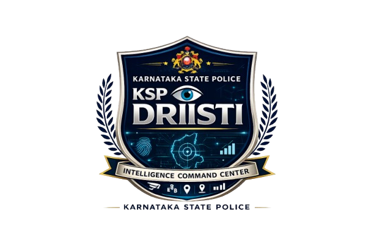

# <p align="center"><br>KSP DRISTI</p>
<p align="center">
  <strong>ಕಲ್ಪಿಸಿಕೊಡುವ ಸುರಕ್ಷತಾ ತಂತ್ರಜ್ಞಾನ</strong><br>
  <em>Intelligent Conversational AI & Crime Analytics Platform for the Karnataka State Police</em>
</p>

<p align="center">
  
  
  
</p>

---

**KSP DRISTI** is a production-ready, full-stack crime intelligence command center custom-built for the **Karnataka State Police (KSP)**. The platform integrates a high-performance **Next.js Web Dashboard** and a native **Flutter Mobile Companion App**, working together to enable real-time geospatial beat patrol planning, relational network tracing, demographic profiling, and voice-activated intelligence retrieval.

---

## 🌟 Core Taglines
* **"ಕಲ್ಪಿಸಿಕೊಡುವ ಸುರಕ್ಷತಾ ತಂತ್ರಜ್ಞಾನ"** — *Fostering Safety through Technology.*
* **"Intelligent Conversational Criminology"** — *Empowering field officers with smart, localized peer conversations and real-time database query syntheses.*

---

## 🚀 Key Features

* 🎙️ **Conversational Voice AI**: Integrated **Speech-to-Text** supporting English, Hindi, and Kannada inputs, with responses dynamically synthesized and translated into the active query language.
* 🗺️ **Predictive Beat Patrolling**: Dark-themed geolocated Leaflet maps showing crime hotspots with auto-calculated, optimized patrol route waypoints.
* 🕸️ **Link Analysis Graph**: Interactive associate network maps displaying accomplice relationships and tracing money laundering paths/mule bank accounts.
* 📊 **Offender Recidivism Risk Gauges**: Probability gauges forecasting repeat-offence likelihood based on historical arrest logs.
* 📈 **Demographic & Sociological Analytics**: Live distribution charts detailing crime categories across ages, occupations, and locations.
* 📂 **Instant Dossier Generation**: 1-click downloads compiling full session logs and crime intelligence briefs into professional PDF reports.

---

## 💻 Running the Web Application (Next.js)

The web command dashboard serves as the central platform for analysts, supervisors, and policymakers.

### 1. Requirements
* **Node.js**: v18.x or higher
* **npm** or **yarn**

### 2. Environment Setup
Create a `.env.local` file at the root of the project:
```env
# Groq API Key (Used for LLM Chat Synthesis and Translation Fallbacks)
GROQ_API_KEY=gsk_your_groq_key_here

# Live Intel Feeds (Optional NewsAPI key)
NEWS_API_KEY=your_news_api_key_here

# Zoho Catalyst Credentials (If integrating Zoho Cloud DB)
ZOHO_CATALYST_PROJECT_ID="your_project_id"
ZOHO_CATALYST_ZAID="your_zaid"
ZOHO_CATALYST_CLIENT_ID="your_client_id"
ZOHO_CATALYST_CLIENT_SECRET="your_client_secret"
ZOHO_CATALYST_REFRESH_TOKEN="your_refresh_token"
```
*(Note: If Zoho Catalyst variables are empty, the server automatically reads from `public/sample_fir_data.json` containing 1,200 local geocoded FIR logs for zero-setup local execution).*

### 3. Installation & Run
```bash
# Install package dependencies
npm install

# Start the local development server
npm run dev
```
Open **[http://localhost:3000](http://localhost:3000)** in your browser. Authentication/Login has been bypassed for convenience so you can proceed directly to the command panel.

---

## 📱 Running the Mobile App (Flutter)

The native companion app is designed for on-duty field officers to capture voice prompts and review suspect details on the fly.

### 1. Requirements
* **Flutter SDK**: Stable channel (v3.x)
* **Android Studio** (for Android Emulator/SDK) or **Xcode** (for iOS simulator, macOS only)
* **Java**: OpenJDK 17

### 2. Dependency Setup
```bash
# Navigate to the mobile app directory
cd KSP_Dristi

# Fetch flutter dependencies
flutter pub get
```

### 3. Running the App
* Connect your physical device or launch your emulator.
* Start the app locally:
```bash
flutter run
```
* **Dynamic Server Configuration**: Tap the **Settings Cog** in the top-right corner of the mobile interface to dynamically specify your local Next.js server endpoint IP (e.g. `http://10.0.2.2:3000/api/chat` for local Android emulators). 

### 4. Compiling the Standalone Android APK
To compile the final release package:
```bash
# Define Java 17 path (example path for macOS brew install)
export JAVA_HOME=/opt/homebrew/opt/openjdk@17/libexec/openjdk.jdk/Contents/Home

# Build the release package
flutter build apk --release
```
The compiled release package will be generated at:
`KSP_Dristi/build/app/outputs/flutter-apk/app-release.apk`

---

## 📂 Repository Structure

```text
├── public/                       # Favicons, geocoded datasets, and asset files
├── scripts/                      # Helper Python scripts for generating mock FIR databases
├── src/
│   ├── app/                      # Next.js Application router
│   │   ├── api/                  # Backend endpoints (chat synthesis, translations, RSS feeds)
│   │   │   ├── chat/             # Conversational intent parsing and database synthesis
│   │   │   └── translate/        # Legal translation engine
│   │   └── page.tsx              # Main dashboard frontend interface
│   ├── components/               # Specialized panels ( हॉटस्पॉट Maps, accomplice graphs, risk gauges)
│   └── lib/                      # PDF compilation & local SQLite query parsers
└── KSP_Dristi/                   # Flutter Mobile application folder
    ├── lib/                      # Flutter screens, voice recorder state, and API services
    └── pubspec.yaml              # Flutter dependencies configuration
```

---
<p align="center"><strong>CONFIDENTIAL — FOR INTERNAL KARNATAKA STATE POLICE USE ONLY</strong></p>
