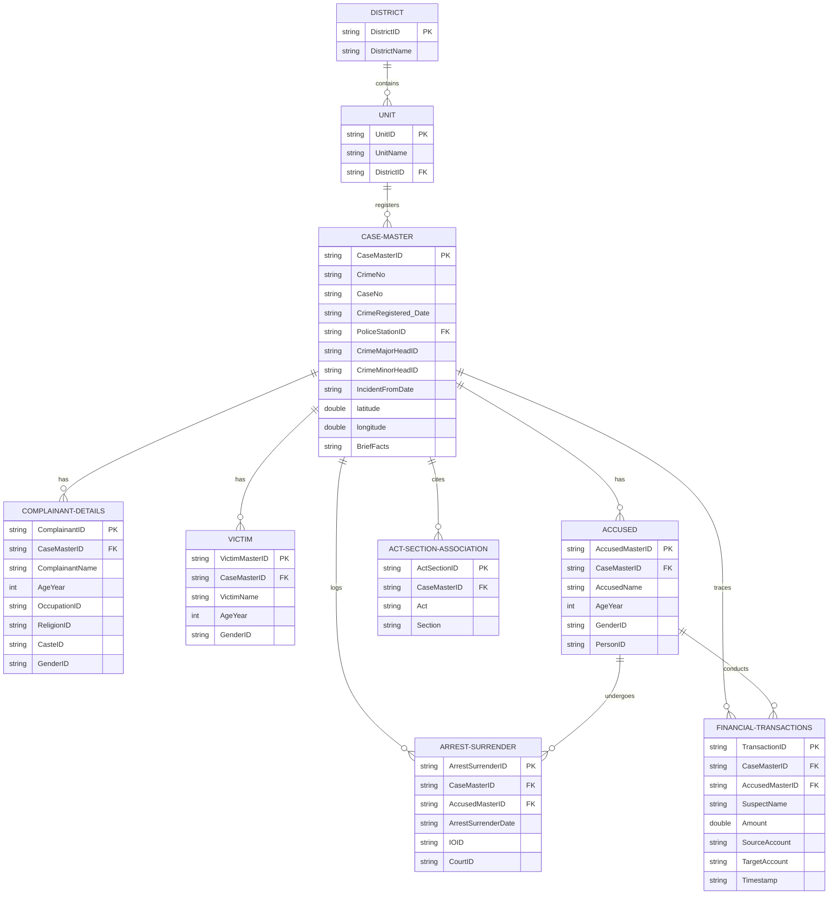

# KSP DRISTI - System Architecture Document

This document outlines the high-level system architecture, database schema, entity-relationship models, and component integrations of **KSP DRISTI** (Conversational Intelligence & Crime Analytics Platform).

---

## 🏗️ 1. High-Level System Architecture

KSP DRISTI is built as a dual-interface command system (React Web and Flutter Mobile) that queries a Zoho Catalyst relational datastore (ZCQL) and integrates Groq LLM pipelines.

### Styled Block Architecture Diagram
The following diagram shows the sequential processing flow, controllers, data delivery paths, databases, and UI layers of the application.

```mermaid
graph LR
    %% Styling Definitions
    classDef intelPurple fill:#f3e8ff,stroke:#a855f7,stroke-width:2px,color:#581c87,font-weight:bold;
    classDef seqBlue fill:#e0f2fe,stroke:#0ea5e9,stroke-width:2px,color:#0369a1,font-weight:bold;
    classDef valOrange fill:#ffedd5,stroke:#f97316,stroke-width:2px,color:#c2410c,font-weight:bold;
    classDef deliveryGreen fill:#dcfce7,stroke:#22c55e,stroke-width:2px,color:#15803d,font-weight:bold;
    classDef xaiGray fill:#f3f4f6,stroke:#6b7280,stroke-width:2px,color:#374151,font-weight:bold;
    classDef boundaryStyle fill:#fafafa,stroke:#4b5563,stroke-width:2.5px,stroke-dasharray: 6 6,color:#1f2937,font-weight:bold;

    Input([Feature Query / Speech Input]) --> Seq1
    
    Seq1["FEATURE NORMALIZATION ENGINE<br>• Slang & Abbreviation Resolving<br>• Hinglish Lexicon Normalizer<br>• Speech-to-Text en-IN/kn-IN Ingestion"]:::seqBlue
    
    Seq1 --> |Clean Query String| Intel2
    
    Intel2["ADAPTIVE INTENT ROUTER (Groq API)<br>• Dynamic Strategy & Intent Mapping<br>• Contextual Parameter Parsing<br>• Criminological Query Planning"]:::intelPurple
    
    Intel2 --> |ZCQL Constraints| Val3
    
    Val3["ZCQL AST INTERPRETER<br>• AST Parsing and Evaluation<br>• In-Memory SQL Execution (Joins/LIKE)<br>• Emulated Zoho Catalyst Relational Engine"]:::valOrange
    
    Val3 --> |Tabular Result Rows| Val4
    
    Val4["ENTITY ENRICHMENT LAYER<br>• Osm Nominatim Geocoding Lookup<br>• IP Tracing & ISP Provider Resolving<br>• Live News & RSS Feed Contexualization"]:::valOrange
    
    Val4 --> |Processed Intelligence payload| Del5
    
    Del5["DATA DELIVERY CHANNEL (API Gateway)<br>• Combined API Payload Delivery<br>• Geolocated Beat Points<br>• SVG Accomplice/Transaction Maps"]:::deliveryGreen

    Del5 --> DB[("RELATIONAL DATABASE<br>• CaseMaster (FIR Details)<br>• Complainant & Victim Tables<br>• Accused & ArrestSurrender Log<br>• ActSectionAssociation (BNS/IPC)<br>• FinancialTransactions (Mule Accts)")]:::deliveryGreen

    
    Del5 --> OutputLayer
    DB --> OutputLayer
    
    OutputLayer["OUTPUT SYNTHESIS LAYER<br>• Natural Language Briefing Generation<br>• Geospatial Marker Points<br>• Transaction Graph SVG Nodes<br>• Recidivism Timelines & Risk Scores"]:::deliveryGreen
    
    OutputLayer --> XAI
    XAI["EXPLAINABLE AI LAYER (SQL Console)<br>• Decision Trace ZCQL Console Output<br>• Input Parameter Logs & Citations<br>• Confidence Scoring Verification<br>• Raw Database Rows Audit Console"]:::xaiGray
    XAI --> OutputLayer
    
    DB --> UI
    OutputLayer --> UI

    subgraph UI ["USER INTERFACE LAYER (DRISTI COMMAND DASHBOARD)"]
        UI1["DRISTI DASHBOARD<br>Real-time crime statistics overview, role controls, and global filters"]:::deliveryGreen
        
        UI2["HOTSPOT MAP VISUALIZATION<br>Leaflet maps showing spatial clusters, beat generator waypoints, and routing"]:::deliveryGreen
        
        UI3["NETWORK LINKAGES GRAPH<br>Interactive accomplice chains, transaction flows, and bank accounts nodes"]:::deliveryGreen
        
        UI4["DOSSIER & LEGAL MODULE<br>Automated case dossier PDF compilation, BNS legal recommendations"]:::deliveryGreen
    end
    class UI boundaryStyle;
```



---

## 🗄️ 2. Relational Entity-Relationship Diagram (ERD)

The database schema matches the expected relational model parsed from the real 1.6 Million row Karnataka State Police dataset:



---

## 🗄️ 3. Relational Database Schema SQL Code (DDL)

```sql
CREATE TABLE District (
    DistrictID VARCHAR(20) PRIMARY KEY,
    DistrictName VARCHAR(100) NOT NULL
);

CREATE TABLE Unit (
    UnitID VARCHAR(20) PRIMARY KEY,
    UnitName VARCHAR(100) NOT NULL,
    DistrictID VARCHAR(20) NOT NULL REFERENCES District(DistrictID) ON DELETE CASCADE
);

CREATE TABLE CaseMaster (
    CaseMasterID VARCHAR(30) PRIMARY KEY,
    CrimeNo VARCHAR(50) UNIQUE NOT NULL,
    CaseNo VARCHAR(50),
    CrimeRegistered_Date TIMESTAMP,
    PoliceStationID VARCHAR(20) NOT NULL REFERENCES Unit(UnitID) ON DELETE RESTRICT,
    CrimeMajorHeadID VARCHAR(250),
    CrimeMinorHeadID VARCHAR(250),
    IncidentFromDate DATE,
    Latitude DECIMAL(10, 7),
    Longitude DECIMAL(10, 7),
    BriefFacts TEXT
);

CREATE TABLE ComplainantDetails (
    ComplainantID VARCHAR(30),
    CaseMasterID VARCHAR(30) REFERENCES CaseMaster(CaseMasterID) ON DELETE CASCADE,
    ComplainantName VARCHAR(150),
    AgeYear INT,
    OccupationID VARCHAR(250),
    ReligionID VARCHAR(250),
    CasteID VARCHAR(250),
    GenderID VARCHAR(20),
    PRIMARY KEY (CaseMasterID, ComplainantID)
);

CREATE TABLE Victim (
    VictimMasterID VARCHAR(30),
    CaseMasterID VARCHAR(30) REFERENCES CaseMaster(CaseMasterID) ON DELETE CASCADE,
    VictimName VARCHAR(150),
    AgeYear INT,
    GenderID VARCHAR(20),
    PRIMARY KEY (CaseMasterID, VictimMasterID)
);

CREATE TABLE Accused (
    AccusedMasterID VARCHAR(30),
    CaseMasterID VARCHAR(30) REFERENCES CaseMaster(CaseMasterID) ON DELETE CASCADE,
    AccusedName VARCHAR(150),
    AgeYear INT,
    GenderID VARCHAR(20),
    PersonID VARCHAR(20),
    PRIMARY KEY (CaseMasterID, AccusedMasterID)
);

CREATE TABLE ArrestSurrender (
    ArrestSurrenderID VARCHAR(30),
    CaseMasterID VARCHAR(30) REFERENCES CaseMaster(CaseMasterID) ON DELETE CASCADE,
    AccusedMasterID VARCHAR(30),
    ArrestSurrenderDate DATE,
    IOID VARCHAR(20),
    CourtID VARCHAR(20),
    PRIMARY KEY (ArrestSurrenderID, CaseMasterID, AccusedMasterID),
    CONSTRAINT fk_arrest_accused FOREIGN KEY (CaseMasterID, AccusedMasterID) REFERENCES Accused(CaseMasterID, AccusedMasterID) ON DELETE CASCADE
);

CREATE TABLE ActSectionAssociation (
    ActSectionID VARCHAR(30),
    CaseMasterID VARCHAR(30) REFERENCES CaseMaster(CaseMasterID) ON DELETE CASCADE,
    Act VARCHAR(250),
    Section VARCHAR(50),
    PRIMARY KEY (CaseMasterID, ActSectionID)
);

CREATE TABLE FinancialTransactions (
    TransactionID VARCHAR(30),
    CaseMasterID VARCHAR(30) REFERENCES CaseMaster(CaseMasterID) ON DELETE CASCADE,
    AccusedMasterID VARCHAR(30),
    SuspectName VARCHAR(150),
    Amount DECIMAL(15, 2),
    SourceAccount VARCHAR(100),
    TargetAccount VARCHAR(100),
    TransactionTimestamp TIMESTAMP,
    PRIMARY KEY (TransactionID, CaseMasterID, AccusedMasterID),
    CONSTRAINT fk_txn_accused FOREIGN KEY (CaseMasterID, AccusedMasterID) REFERENCES Accused(CaseMasterID, AccusedMasterID) ON DELETE SET NULL
);
```

---

## 🛠️ 4. Technology Stack & Key Highlights

| Component / Layer | Technology Chosen | Purpose & Core Advantage |
| :--- | :--- | :--- |
| **Frontend Framework** | Next.js 14+ (React) | High-performance command state compilation, layout routing. |
| **Styling (CSS)** | Vanilla CSS + Tailwind v4 | Dynamic UI themes, grid structures, and glassmorphism charts. |
| **Mobile Companion** | Flutter SDK (Dart) | Native mobile screens for beat patrol navigation and search access. |
| **AI Inference** | Groq Llama 3.3 (70B) | ~50ms latency for extracting intents and compiling case briefs. |
| **DB / SQL engine** | ZCQL Helper Utility | AST-based SQL parser driving offline joins and filtering queries on JSON data. |
| **Mapping Engine** | Leaflet / React Leaflet | Overlay routing polylines, hotspot marker aggregation, and dynamic center updates. |
| **PDF Dossier** | jsPDF Library | Client-side multiline styling, table alignment, and transaction graph snapshots exporting. |
| **Voice Processing** | Web Speech API | Multi-lingual voice processing (`kn-IN` & `en-IN`) without cloud subscription costs. |
