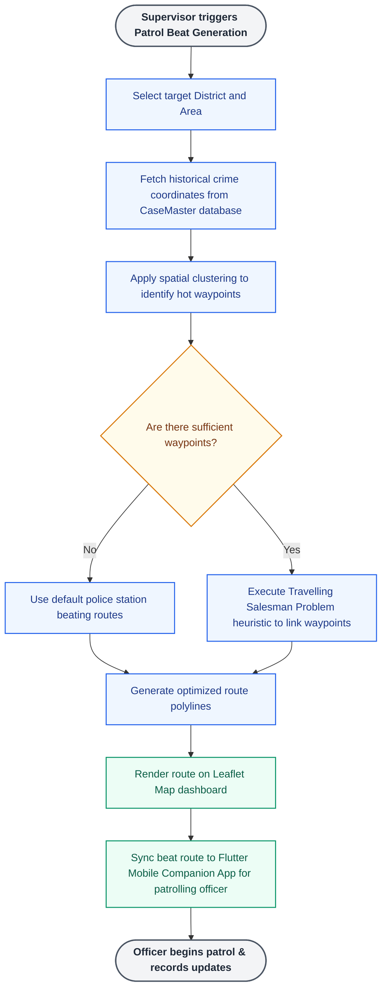

# KSP DRISTI - System Use Cases & Process Flow Diagrams

This document contains unified, styled, and color-coded representations of the **Use-Case Diagram**, **Process Flow Diagrams**, and the **UML Class Text Notation** for **KSP DRISTI**.

---

## 🗺️ 1. Complete System Use-Case Diagram

This diagram details the interaction between the system boundary, primary actors, and their specific goals, categorizing features by system modules.

```mermaid
graph TB
    %% Styling Definitions to match Legend Colors
    classDef actorStyle fill:#2c3e50,stroke:#34495e,stroke-width:2px,color:#fff,font-weight:bold;
    classDef ucInvestigator fill:#eff6ff,stroke:#2563eb,stroke-width:2px,color:#1e3a8a,font-weight:bold;
    classDef ucAnalyst fill:#faf5ff,stroke:#a855f7,stroke-width:2px,color:#581c87,font-weight:bold;
    classDef ucSupervisor fill:#fffbeb,stroke:#d97706,stroke-width:2px,color:#78350f,font-weight:bold;
    classDef ucPolicymaker fill:#f0fdf4,stroke:#16a34a,stroke-width:2px,color:#14532d,font-weight:bold;
    classDef systemBoundary fill:#ffffff,stroke:#4b5563,stroke-width:3px,stroke-dasharray: 8 8,color:#1f2937,font-weight:bold;

    %% ACTORS
    subgraph Actors ["👮 SYSTEM USERS"]
        I["👮 Investigator<br>(Field Officer)"]:::actorStyle
        A["🧠 Analyst<br>(Crime Hub)"]:::actorStyle
        S["🛰️ Supervisor<br>(Beat Dispatcher)"]:::actorStyle
        P["📈 Policymaker<br>(State Level)"]:::actorStyle
    end

    %% SYSTEM BOUNDARY & USE CASES
    subgraph Boundary ["KSP DRISTI COMMAND PLATVISION"]
        
        %% Investigator Use Cases (Blue)
        subgraph InvestigatorModule ["INVESTIGATION SUPPORT SERVICES"]
            UCI1("Voice-Enabled Query Search<br>(en-IN & kn-IN)"):::ucInvestigator
            UCI2("1-Click PDF Dossier Export<br>(jsPDF Generation)"):::ucInvestigator
            UCI3("Suggest BNS/IPC Penal Codes<br>(Legal Reference Mapping)"):::ucInvestigator
            UCI4("Digital FIR Filing Portal<br>(ZCQL Database Seed)"):::ucInvestigator
        end

        %% Analyst Use Cases (Purple)
        subgraph AnalystModule ["INTELLIGENCE ANALYTICS SERVICE"]
            UCA1("Map Accomplice Networks<br>(SVG Linkage Visualizer)"):::ucAnalyst
            UCA2("Trace Financial Money Trails<br>(Mule Bank Account Nodes)"):::ucAnalyst
            UCA3("Assess Offender Recidivism Risk<br>(Recidivism Gauge Engine)"):::ucAnalyst
        end

        %% Supervisor Use Cases (Orange)
        subgraph SupervisorModule ["PATROL MANAGEMENT DIVISION"]
            UCS1("Identify Regional Hotspots<br>(Leaflet Heatmap)"):::ucSupervisor
            UCS2("Generate Predictive Beat Patrols<br>(Optimized Waypoints)"):::ucSupervisor
            UCS3("Monitor Live News Updates<br>(Local Prajavani/NewsAPI Feeds)"):::ucSupervisor
        end

        %% Policymaker Use Cases (Green)
        subgraph PolicymakerModule ["SOCIOLOGICAL TREND ENGINE"]
            UCP1("Analyze Victim Demographics<br>(Age/Religion/Caste Charts)"):::ucPolicymaker
            UCP2("Audit Generated SQL Commands<br>(ZCQL Console)"):::ucPolicymaker
        end

    end
    class Boundary systemBoundary;

    %% ACTOR TO USE-CASE LINKAGES
    I --> UCI1
    I --> UCI2
    I --> UCI3
    I --> UCI4

    A --> UCA1
    A --> UCA2
    A --> UCA3
    A --> UCP1

    S --> UCI1
    S --> UCS1
    S --> UCS2
    S --> UCS3

    P --> UCP1
    P --> UCP2
    P --> UCS3
```



---

## 🔄 2. Core Process Flow Diagrams

### Flow A: Conversational Query Flow
Illustrates how user speech or text input is preprocessed, normalized, parsed to relational query constraints, executed, and outputted visually across the command UI layers.

```mermaid
graph TD
    %% Styling Definitions
    classDef intelPurple fill:#f3e8ff,stroke:#a855f7,stroke-width:2px,color:#581c87,font-weight:bold;
    classDef seqBlue fill:#e0f2fe,stroke:#0ea5e9,stroke-width:2px,color:#0369a1,font-weight:bold;
    classDef valOrange fill:#ffedd5,stroke:#f97316,stroke-width:2px,color:#c2410c,font-weight:bold;
    classDef deliveryGreen fill:#dcfce7,stroke:#22c55e,stroke-width:2px,color:#15803d,font-weight:bold;
    classDef xaiGray fill:#f3f4f6,stroke:#6b7280,stroke-width:2px,color:#374151,font-weight:bold;
    classDef startEnd fill:#fafafa,stroke:#374151,stroke-width:2.5px,color:#1f2937,font-weight:bold;

    Start([User Inputs Speech or Text Query]) --> Stage1
    
    subgraph Stage1Container ["STAGE 1: INPUT NORMALIZATION"]
        Stage1["TEXT NORMALIZER<br>• Transcribes speech (Web Speech API)<br>• Converts Hinglish & local shorthand<br>• Standardizes station terms (e.g. ps -> police station)"]:::seqBlue
    end
    
    Stage1 --> |Clean Input Query| Stage2
    
    subgraph Stage2Container ["STAGE 2: INTENT RESOLUTION & PLANNING"]
        Stage2["ADAPTIVE INTENT ROUTER (Groq LLM)<br>• Parses search parameters & filters<br>• Identifies data requirement types<br>• Resolves pronouns & session context"]:::intelPurple
    end
    
    Stage2 --> |Structured JSON Filters| Stage3
    
    subgraph Stage3Container ["STAGE 3: REFINEMENT & DATA RETRIEVAL"]
        Stage3["ZCQL SQL INTERPRETER & GEOCODING<br>• Builds SQL query dynamically<br>• Joins CaseMaster & Accused tables<br>• Runs Osm Geocoding / IP Lookup"]:::valOrange
    end
    
    Stage3 --> |Relational JSON Database Rows| Stage4
    
    subgraph Stage4Container ["STAGE 4: BRIEFING SYNTHESIS"]
        Stage4["CRIMINOLOGY REPORT WRITER (Groq LLM)<br>• Synthesizes facts & numbers<br>• Suggests BNS/IPC penal codes<br>• Appends live local news feed updates"]:::deliveryGreen
    end
    
    Stage4 --> |Final Unified API Payload| Stage5
    
    subgraph Stage5Container ["STAGE 5: EXPLAINABLE AI AUDIT"]
        Stage5["XAI CONSOLE ROUTER<br>• Logs executed SQL to trace console<br>• Attaches raw database references<br>• Flags security/role-based alerts"]:::xaiGray
    end
    
    Stage5 --> |Synchronized State Update| Stage6
    
    subgraph Stage6Container ["STAGE 6: DASHBOARD PRESENTATION LAYERS"]
        Stage6["FRONTEND STATE UPDATE<br>• Populates conversational chatbot log<br>• Focuses Leaflet Map & displays beat path<br>• Traces D3 accomplice graph nodes<br>• Updates offender risk timeline panel"]:::deliveryGreen
    end
    
    Stage6 --> End([Dashboard displays results to Criminologist])
```



### Flow B: Predictive Beat Patrol Generation Process


---

## 👥 3. UML Text Notation (Actors, Database & Services)

### System User Roles
```text
Investigator
-kgid: String
-name: String
-policeStationId: String
-role: String
-preferredLanguage: String
--
+voiceSearch(query: String, language: String): APIPayload
+fileDigitalFIR(caseData: CaseMaster): boolean
+viewBNSRecommendations(crimeMajorHead: String): List<ActSectionAssociation>
+exportPDFDossier(caseMasterId: String): File

Analyst
-employeeId: String
-name: String
-department: String
-role: String
--
+exploreAccompliceNetwork(accusedId: String): NetworkGraphData
+traceFinancialTransactions(accusedId: String): List<FinancialTransactions>
+calculateRecidivismGauge(accusedId: String): int
+viewSociologicalDemographics(): DemographicsData

Supervisor
-dispatcherId: String
-name: String
-jurisdictionDistrict: String
-role: String
--
+identifyCrimeHotspots(district: String): List<CaseMaster>
+generatePredictiveBeatPatrol(waypoints: List<Coordinates>): List<Coordinates>
+dispatchBeatRouteToMobile(routeId: String, officerKgid: String): boolean
+monitorLiveIntelFeed(district: String): List<IntelItem>

Policymaker
-policyId: String
-name: String
-stateDepartment: String
-role: String
--
+viewStatewideCrimeTrends(): TrendsData
+analyzeSociologicalImpact(caste: String, religion: String): ImpactAnalysis
+auditSystemQueries(): List<ZCQLTraceLog>
```

### Relational Schema Classes
```text
District
-districtId: String
-districtName: String
--
+getUnits(): List<Unit>

Unit
-unitId: String
-unitName: String
-districtId: String
--
+getCasesRegistered(): List<CaseMaster>
+getDistrict(): District

CaseMaster
-caseMasterId: String
-crimeNo: String
-caseNo: String
-crimeRegisteredDate: DateTime
-policeStationId: String
-crimeMajorHeadId: String
-crimeMinorHeadId: String
-incidentFromDate: Date
-latitude: Double
-longitude: Double
-briefFacts: String
--
+getComplainant(): ComplainantDetails
+getVictims(): List<Victim>
+getAccused(): List<Accused>
+getArrests(): List<ArrestSurrender>
+getApplicableActs(): List<ActSectionAssociation>
+getTransactions(): List<FinancialTransactions>

ComplainantDetails
-complainantId: String
-caseMasterId: String
-complainantName: String
-ageYear: int
-occupationId: String
-religionId: String
-casteId: String
-genderId: String
--
+getAssociatedCase(): CaseMaster

Victim
-victimMasterId: String
-caseMasterId: String
-victimName: String
-ageYear: int
-genderId: String
--
+getAssociatedCase(): CaseMaster

Accused
-accusedMasterId: String
-caseMasterId: String
-accusedName: String
-ageYear: int
-genderId: String
-personId: String
--
+getArrestHistory(): List<ArrestSurrender>
+getTransactionLogs(): List<FinancialTransactions>
+getAssociatedCase(): CaseMaster

ArrestSurrender
-arrestSurrenderId: String
-caseMasterId: String
-accusedMasterId: String
-arrestSurrenderDate: Date
-ioid: String
-courtId: String
--
+getAccusedDetails(): Accused
+getCaseDetails(): CaseMaster

ActSectionAssociation
-actSectionId: String
-caseMasterId: String
-act: String
-section: String
--
+getAssociatedCase(): CaseMaster

FinancialTransactions
-transactionId: String
-caseMasterId: String
-accusedMasterId: String
-suspectName: String
-amount: Double
-sourceAccount: String
-targetAccount: String
-transactionTimestamp: DateTime
--
+getAssociatedCase(): CaseMaster
+getSuspectAccused(): Accused
```

### Backend Micro-services
```text
TextNormalizer
-abbreviationMap: Map<String, String>
-hinglishDictionary: Map<String, String>
--
+normalizeHumanText(rawQuery: String): String
+resolveAbbreviations(word: String): String

IntentRouter
-groqClient: GroqAPI
-systemPrompt: String
--
+classifyQueryIntent(query: String, history: List<Message>): IntentFilters
+extractQueryParameters(query: String): Map<String, String>

ZcqlHelper
-dbCache: JSONPayload
-schemaDefinition: String
--
+executeZCQL(query: String): QueryResult
+parseAST(sql: String): SQLStatement
+evaluateWhereClause(rows: List<Row>, filters: List<Filter>): List<Row>

BeatGenerator
-kmeansClusterer: KMeans
-tspSolver: TSPSolver
--
+clusterHotspots(cases: List<CaseMaster>, k: int): List<Coordinates>
+computeShortestPatrolRoute(waypoints: List<Coordinates>): List<Coordinates>

RecidivismEngine
-baseRate: Double
-severityWeights: Map<String, Double>
--
+calculateOffenderRisk(accusedId: String): int
+analyzeCrimeSeverity(crimeGroup: String): Double
```
